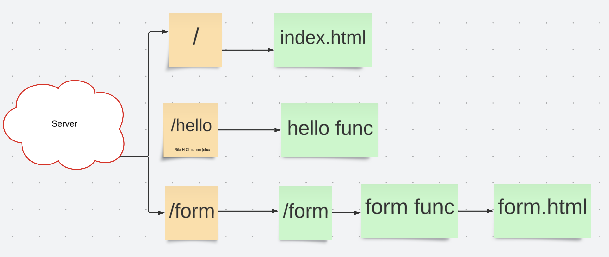

# Go SERVER BASIC

### Create a basic form on Html and server it through go at the respective route
### Submit and print the output of the form
### Create some other basic routes for tesing, paired with html for rendering fromtend 

# Routes

